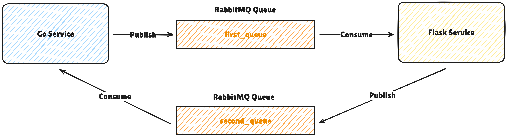

# 📨 Event-Driven Architecture Study with RabbitMQ, Go, and Flask

This project demonstrates an Event-Driven Architecture (EDA) using RabbitMQ as a Message Broker.
Two microservices — one built with Go and the other with Flask (Python) — communicate asynchronously by producing and consuming messages through RabbitMQ.

Both services act as Producer and Consumer simultaneously, showcasing bi-directional event communication.

## 🧠 Overview

Event-Driven Architecture enables services to communicate through events rather than direct API calls.
In this demo, RabbitMQ serves as the intermediary that handles message delivery, ensuring loose coupling, scalability, and resilience between the Go and Flask services.

## 🏗️ Architecture Flow



1. The **Go service** and **Flask service are** connected to **RabbitMQ**.

2. Each service can:

   - **Publish** messages to a RabbitMQ queue.

   - **Consume** messages from the same queue.

3. When one service publishes a message, the other service receives it and logs the result.

## 🚀 Running the Services

1. Clone this repository:
   ```bash
   git clone https://github.com/canonflow/rabbitmq-study-with-go-and-flask.git
   cd rabbitmq-study-with-go-and-flask
   ```
2. Start all services:
   ```bash
    docker compose up --build
   ```
3. This will spin up:

- `RabbitMQ` (with management UI at http://localhost:15672)

- `Go service` (listening on port **3000**)

- `Flask service` (listening on port **8090**)

## 🧪 Testing the Communication

Once all containers are running, you can test the message exchange between services.

### ▶️ From Go → Flask

- Send POST request to `localhost:8090/publish`
- You should see a log on the Flask container:

  ```bash
  flask_service     | INFO:__main__: [x] Received: {"message":"Hello From Golang","state":"Publish to RabbitMQ"}
  ```

### ◀️ From Flask → Go

- Send POST request to `localhost:3000/send`
- You should see a log on the Go container:

  ```bash
  go_service        | Received Message: map[message:Hello From Flask! source:flask timestamp:2025-10-29T15:30:00Z]
  ```
